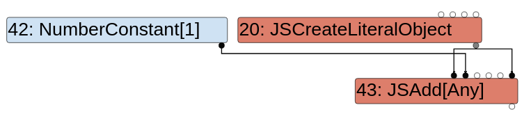

```javascript
let opt_me = (x) => {
  let y = x ? 
    ({valueOf() { return 10; }})
    :
    ({[Symbol.toPrimitive]() { return 20; }});
  return y + 1;
}

opt_me(true);
%OptimizeFunctionOnNextCall(opt_me);
opt_me(false);
```


