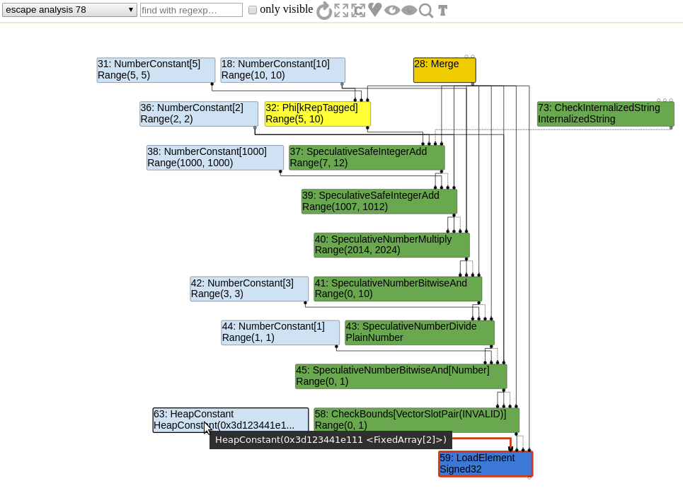
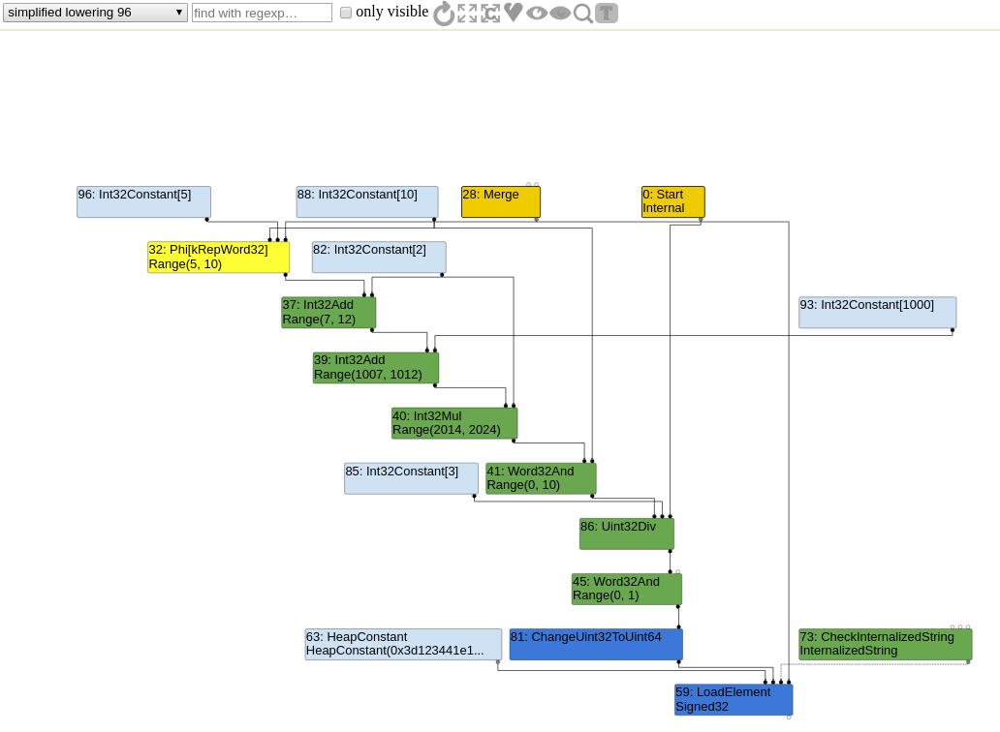

```javascript
function opt_me(b,ta) {
  let values = [42,1337];       // HeapConstant <FixedArray[2]>
  let x = 10;                   // NumberConstant[10]          | Range(10,10)
  if (b == "foo")
    x = 5;                      // NumberConstant[5]           | Range(5,5)
                                // Phi                         | Range(5,10)
  let y = x + 2;                // SpeculativeSafeIntegerAdd   | Range(7,12)
  y = y + 1000;                 // SpeculativeSafeIntegerAdd   | Range(1007,1012)
  y = y * 2;                    // SpeculativeNumberMultiply   | Range(2014,2024)
  y = y & 10;                   // SpeculativeNumberBitwiseAnd | Range(0,10)
  y = y / 3;                    // SpeculativeNumberDivide     | PlainNumber
  y = y & 1;                    // SpeculativeNumberBitwiseAnd | Range(0,1)
  return values[y];             // CheckBounds                 | Range(0,1)
}
```

You may want to use `--trace-representation` (trace representation types) to observe the `DefereReplacement` from `VisitCheckBounds` (`src/compiler/simplified-lowering.cc`).

During the `SimplifiedLoweringPhase`, when `CheckBounds` nodes are visited, if the range of the current index is in the bounds of the input object, then TurboFan will decide to remove the node.

In this case, when visiting the `CheckBounds`, the input is a constant `FixedArray[2]` (length is 2) and the index Range is `(0,1)`, which is in bounds. Therefore, the node is removed.

### Before simplified lowering



### After simplified lowering


