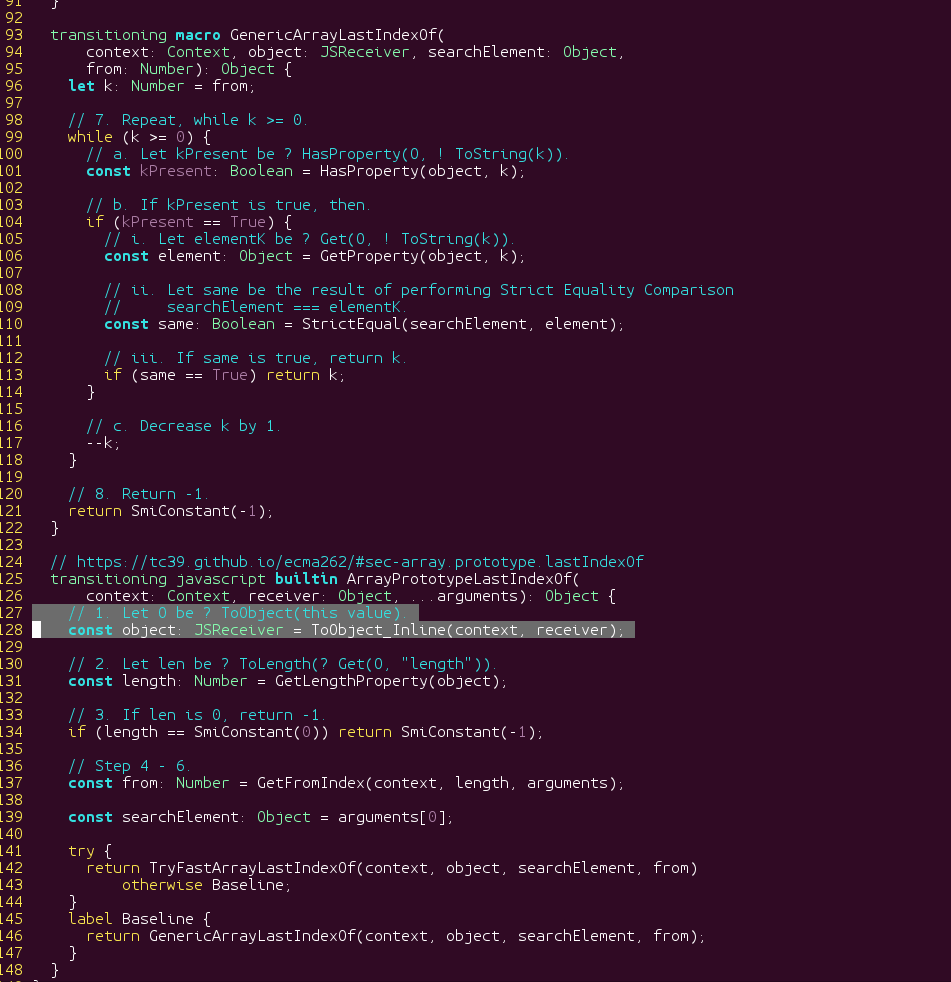

This bug is in the [Torque](https://v8.dev/docs/torque) implementation of the builtin `Array.prototype.lastIndexOf`.

As for many other bugs in V8 builtins (C++ or [Code Stub Assembly](https://v8.dev/docs/csa-builtins), there is an unexpected side effect due to the possibility of a JS callback using, in this case,  `[Symbol.toPrimitive]`.

Unfortunately, this bug doesn't give any interesting exploitation primitive as this builtin merely returns an integer index.

It seems that this bug is a variant of [another bug from august](https://bugs.chromium.org/p/chromium/issues/detail?id=878845).

# The commit
```
commit b8a911314d00e5c866399b58533a79bddce45fb6
Author: Benedikt Meurer <bmeurer@chromium.org>
Date:   Fri Nov 2 08:00:28 2018 +0100

    [builtins] Fix out-of-bounds in Array#lastIndexOf().
    
    The fast-path in the `ArrayPrototypeLastIndexOf` torque implementation
    didn't check that the `fromIndex` is within the bounds of the JSArray
    _AFTER_ the call to ToInteger, which can have arbitrary side-effects,
    i.e. it can change the length of the array.
    
    R=yangguo@chromium.org
    
    Bug: chromium:898785
    Change-Id: I7ef84143ec8c33148f6e9d451bd52769d5074fb4
    Reviewed-on: https://chromium-review.googlesource.com/c/1314329
    Reviewed-by: Yang Guo <yangguo@chromium.org>
    Commit-Queue: Benedikt Meurer <bmeurer@chromium.org>
    Cr-Commit-Position: refs/heads/master@{#57204}
```

# Overview

```typescript
  // https://tc39.github.io/ecma262/#sec-array.prototype.lastIndexOf
  transitioning javascript builtin ArrayPrototypeLastIndexOf(
      context: Context, receiver: Object, ...arguments): Object {
    // 1. Let O be ? ToObject(this value).
    const object: JSReceiver = ToObject_Inline(context, receiver);

    // 2. Let len be ? ToLength(? Get(O, "length")).
    const length: Number = GetLengthProperty(object); // [1] save the length

    // 3. If len is 0, return -1.
    if (length == SmiConstant(0)) return SmiConstant(-1);

    // Step 4 - 6.
    const from: Number = GetFromIndex(context, length, arguments); // [2] this can call [Symbol.toPrimitive]
    
    // [3] at this point, length might be desynchronized with the actual receiver's length

    const searchElement: Object = arguments[0];

    try {
    // [4] use a fast load primitive using an OOB "from" index
      return TryFastArrayLastIndexOf(context, object, searchElement, from)
          otherwise Baseline;
    }
    label Baseline {
      return GenericArrayLastIndexOf(context, object, searchElement, from);
    }
  }

```

# Live code 


